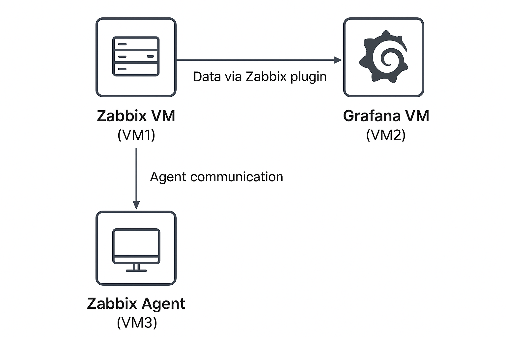

## Introduction

In this project, we are going to build a complete monitoring system using Zabbix and Grafana, deployed across three separate virtual machines (VMs). Each VM plays a specific role in the monitoring architecture:

- VM1 – Zabbix Server + Nginx →
This VM serves as the main monitoring hub by running the Zabbix Server. Additionally, Nginx is installed as the web server to provide web access to the Zabbix dashboard. All monitoring data collected from agents and hosts is processed and managed here.

- VM2 – Zabbix Agent (Client Host) → 
This VM acts as a monitored client host, where the Zabbix Agent is installed. The agent collects performance metrics such as CPU usage, memory, disk I/O, and network activity, then sends this data to the Zabbix Server (VM1). These metrics can later be visualized in Grafana (VM3).

- VM3 – Grafana Server →
This VM runs Grafana, a powerful visualization and analytics platform. Grafana connects to the Zabbix database and allows us to create interactive dashboards, charts, and alerts, making monitoring insights more visual and user-friendly.

With this architecture, you will have a distributed and modular monitoring system: Zabbix as the data collector and Grafana as the visualization layer. This setup ensures scalability, flexibility, and a modern monitoring experience.  

---

## 🔹 VM1 – Zabbix Server + Nginx  

**Purpose:**  
VM1 is the **core of the monitoring system**. It runs Zabbix Server, stores monitoring data, and serves the Zabbix frontend via Nginx.  
**Steps:**  
##### 1. Update OS & Install Dependencies

sudo apt update && sudo apt upgrade -y
sudo apt install wget curl gnupg2 software-properties-common -y


---

##### 2. Install Zabbix Repository & Packages
Download the Zabbix 7.0 LTS repository (stable, long-term support):

wget https://repo.zabbix.com/zabbix/7.0/ubuntu/pool/main/z/zabbix-release/zabbix-release_7.0-2+ubuntu$(lsb_release -rs)_all.deb
sudo dpkg -i zabbix-release_7.0-2+ubuntu$(lsb_release -rs)_all.deb
sudo apt update

Install Zabbix Server + Frontend + Agent:

sudo apt install zabbix-server-mysql zabbix-frontend-php zabbix-nginx-conf zabbix-sql-scripts zabbix-agent -y


---

##### 3. Install & Configure Database (MariaDB/MySQL)
Install MariaDB:

sudo apt install mariadb-server -y
sudo mysql_secure_installation
sudo mysql -uroot -p

Create database & user for Zabbix:

CREATE DATABASE zabbixdb CHARACTER SET utf8 COLLATE utf8_bin;
CREATE USER 'zabbixuser'@'localhost' IDENTIFIED BY 'password';
GRANT ALL PRIVILEGES ON zabbixdb.* TO 'zabbixuser'@'localhost';
FLUSH PRIVILEGES;
EXIT;

Import Zabbix schema:   
- ⚠️ Ensure the schema file exists and the database is empty:

zcat /usr/share/zabbix-sql-scripts/mysql/server.sql.gz | mysql -uzabbixuser -p zabbixdb

- Check imported tables

mysql -uzabbixuser -p zabbixdb -e "SHOW TABLES;"

You should see tables like: users, hosts, etc.
---

##### 4. Configure Zabbix Server
Edit the Zabbix server configuration file:

sudo nano /etc/zabbix/zabbix_server.conf

Find and update:

DBName=zabbixdb
DBUser=zabbixuser
DBPassword=password
DBHost=localhost

*(replace `password` with the one you set for the database user earlier).*

---

##### 5. Permissions & PID Directory
Zabbix may fail to start if the PID folder does not exist:

sudo mkdir -p /run/zabbix
sudo chown zabbix:zabbix /run/zabbix
sudo chmod 755 /run/zabbix


##### 6. Configure Nginx for Zabbix Frontend
Edit the default Zabbix Nginx config:

sudo nano /etc/zabbix/nginx.conf

Adjust it to match your setup:

server {
    listen       80;
    server_name  <IP_VM1>;

    root /usr/share/zabbix;
    index index.php;

    location / {
        try_files $uri $uri/ =404;
    }

    location ~ \.php$ {
        include snippets/fastcgi-php.conf;
        fastcgi_pass unix:/run/php/php8.1-fpm.sock;
        fastcgi_param SCRIPT_FILENAME $document_root$fastcgi_script_name;
        include fastcgi_params;
    }
}

Enable the configuration:

sudo ln -s /etc/zabbix/nginx.conf /etc/nginx/conf.d/
rm /etc/nginx/conf.d/zabbix.conf

Allow port

sudo ufw enable
sudo ufw allow 80/tcp
sudo ufw allow 10051/tcp
sudo ufw status


---

##### 7. Configure php.ini
Edit with sed:

sudo sed -i "s/^post_max_size = .*/post_max_size = 32M/" /etc/php/8.1/fpm/php.ini
sudo sed -i "s/^max_execution_time = .*/max_execution_time = 300/" /etc/php/8.1/fpm/php.ini
sudo sed -i "s/^max_input_time = .*/max_input_time = 300/" /etc/php/8.1/fpm/php.ini
sudo sed -i "s/^;date.timezone =.*/date.timezone = Asia\/Jakarta/" /etc/php/8.1/fpm/php.ini


##### 8. Start & Enable Services
Restart and enable Zabbix, Nginx, and PHP:

sudo systemctl restart zabbix-server zabbix-agent nginx php8.1-fpm
sudo systemctl enable zabbix-server zabbix-agent nginx php8.1-fpm


Check service status:

sudo systemctl status zabbix-server
sudo journalctl -xeu zabbix-server


⚠️ If it still fails, make sure:
- Database exists and schema is imported
- zabbix_server.conf is correct
- /run/zabbix folder exists and is owned by zabbix

##### 9. Access Web UI

Open your browser and go to:  
`http://<IP_VM1>`

You will enter the **Zabbix setup wizard**. Follow these steps:

- **Step 1: Welcome**  
Welcome page → click **Next step**.
- **Step 2: Check of prerequisites**  
Zabbix checks PHP modules, database, and dependencies.  
If you see warnings (e.g., timezone, max execution time), adjust in:  
`/etc/php/8.1/fpm/php.ini`  
Example:  

date.timezone = Asia/Jakarta

- **Step 3: Configure DB connection**  
Fill in database details:  
   - **DB type**: MySQL  
   - **Database host**: localhost  
   - **Database name**: zabbixdb  
   - **User**: zabbixuser  
   - **Password**: (the one you set in MariaDB)  
   Click **Next step**.
- **Step 4: Zabbix server details**  
   - Host: `localhost` (leave default)  
   - Port: `10051` (default Zabbix server port)  
   Click **Next step**.
- **Step 5: Pre-installation summary**  
Review all settings → click **Next step**.
- **Step 6: Install**  
The wizard writes config into:  
`/usr/share/zabbix/conf/zabbix.conf.php`  

   If successful → click **Finish**.

---
-  **Default Zabbix Login**

   Use these credentials to log in:  
   
   Username: Admin
   Password: zabbix
   

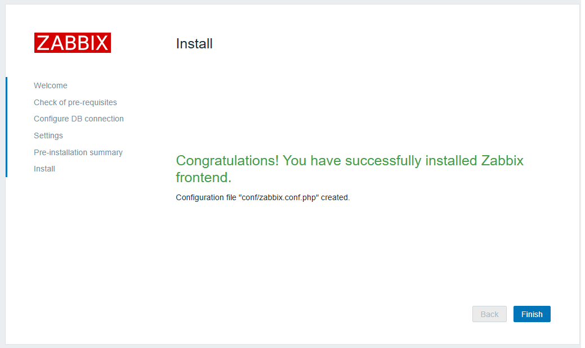

---

##### 10. Zabbix API Setup
Enable and test the Zabbix API on VM1 so that it can be accessed by external applications like Grafana.
- **1. Check Services.** 
   
   sudo systemctl status zabbix-server
   sudo systemctl status nginx
   sudo systemctl status php8.1-fpm # adjust PHP version if different
   
   
- **2. Test API Endpoint**
   
   Check Zabbix API version:
   
   curl -X POST -H "Content-Type: application/json-rpc" \
   -d '{
  "jsonrpc": "2.0",
  "method": "apiinfo.version",
  "params": [],
  "id": 1
   }' \
http://192.168.x.x/api_jsonrpc.php

   
   Expected output (example):

   **{"jsonrpc":"2.0","result":"7.0.17","id":1}**

   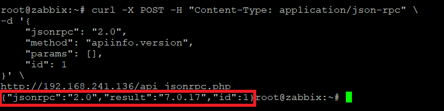
##### ✅ VM1 Setup Completed

At this stage, **VM1 (Zabbix Server)** is fully configured and running:

- **Zabbix Server** is active and connected to the database  
- **Nginx** is configured as the frontend webserver  
- **Zabbix Dashboard** is accessible and login works  
- **Zabbix API** so that it can be accessed by grafana

##### Next Step
Proceed to configure **VM2 (VM-Client)**. The Zabbix Agent sends system metrics to VM1.

---

## 🔹 VM2 – Zabbix Agent (Client) . 

**Purpose:**  
VM2 acts as the **monitored client**. Zabbix Agent will be installed on VM2 so that CPU, RAM, Disk, Network, etc. metrics can be sent to VM1 (Zabbix Server) → then visualized in Grafana (VM3).

**Steps:**  
##### 1. Update System

sudo apt update && sudo apt upgrade -y


---

##### 2. Install Zabbix Agent
Download the Zabbix 7.0 LTS repository (stable, long-term support):

wget https://repo.zabbix.com/zabbix/7.0/ubuntu/pool/main/z/zabbix-release/zabbix-release_7.0-2+ubuntu$(lsb_release -rs)_all.deb
sudo dpkg -i zabbix-release_7.0-2+ubuntu$(lsb_release -rs)_all.deb
sudo apt update

Install Zabbix Agent:

sudo apt install zabbix-agent -y


##### 3. Configure Zabbix Agent
Edit the agent configuration file:

sudo nano /etc/zabbix/zabbix_agentd.conf

Update the following parameters:
   
   -# IP VM1 (Zabbix Server)
   Server=IP_VM1
   ServerActive=IP_VM1
   -# Hostname unik untuk VM2
   Hostname=VM2-Client
   
Save and exit.

##### 4. Configure Firewall
Allow Zabbix Agent port (10050/tcp):

sudo ufw enable
sudo ufw allow 10050/tcp


##### 5. Start & Enable Agent
Restart and enable the agent service:

sudo systemctl restart zabbix-agent
sudo systemctl enable zabbix-agent

Check the service status:

sudo systemctl status zabbix-agent


##### 6. Add VM2 to Zabbix Server (VM1)
Login to Zabbix Web UI on VM1 → http://<IP_VM1>
-  Navigate to: Monitoring → Hosts → Create host

   Fill in:
   - Hostname: VM2-Client (must match Hostname in agent config)
   - Group: Linux servers & Zabbix servers
   - interface: Using Agent & IP of VM2 (ex: 192.168.1.30)
- Go to Templates → Select
   - Click Template/Operating System
   - Choose Template OS Linux by Zabbix agent
- Save.

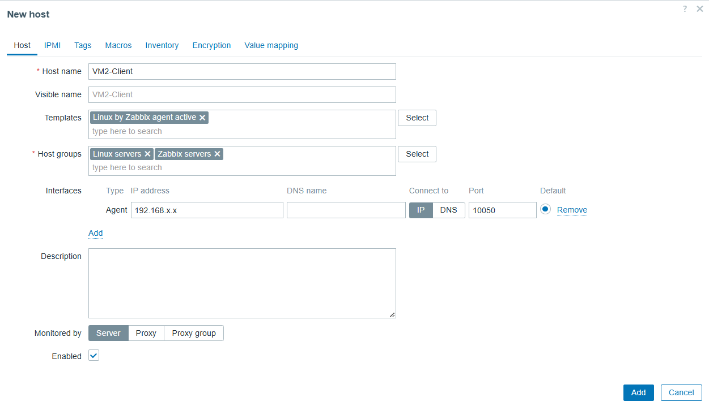

##### 7. Verify in Zabbix
- After a few minutes, go to: Monitoring → Hosts
- The VM2 host should appear with status green (Available) ✅

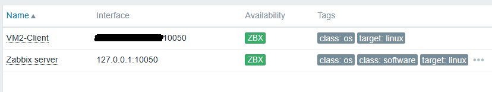

If the status is red (Unavailable):
- Check firewall rules (sudo ufw status)
- Ensure VM1 can reach VM2 on port 10050
- Check agent logs:

sudo tail -f /var/log/zabbix/zabbix_agentd.log


Results after dashboard customization:
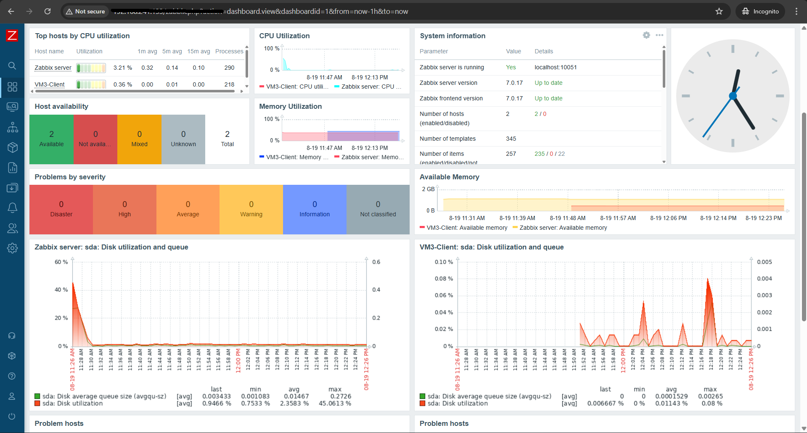

##### ✅ At this point, VM2 is successfully connected and monitored by Zabbix.

## 🔹 VM3 – Grafana Server  

**Purpose:**  
VM3 handles **data visualization**. Grafana connects to Zabbix and provides modern dashboards.  

**Steps:**  

##### 1. Update System
Update all packages to the latest version:

sudo apt update && sudo apt upgrade -y


##### 2. Install Grafana
Download and install the latest stable version:

sudo apt install -y apt-transport-https software-properties-common
sudo mkdir -p /etc/apt/keyrings/
wget -q -O - https://packages.grafana.com/gpg.key | sudo gpg --dearmor -o /etc/apt/keyrings/grafana.gpg
echo "deb [signed-by=/etc/apt/keyrings/grafana.gpg] https://packages.grafana.com/oss/deb stable main" | sudo tee /etc/apt/sources.list.d/grafana.list
sudo apt update
sudo apt install grafana -y


##### 3. Enable & Start Grafana
Open Grafana port (3000), enable service, and start:

sudo ufw allow 3000/tcp
sudo systemctl enable grafana-server
sudo systemctl start grafana-server

Check service status:

systemctl status grafana-server


##### 4. Install Zabbix Plugin for Grafana
To integrate Zabbix with Grafana, install the official plugin:

sudo grafana-cli plugins install alexanderzobnin-zabbix-app

Restart Grafana service:

sudo systemctl restart grafana-server


##### 5. Login to Grafana
Open your browser and go to:  
`http://<IP_VM3>:3000`

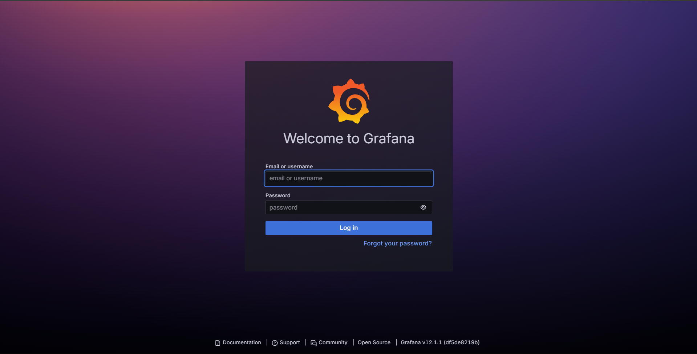

Login using **admin** account. Default login credentials:

Username: admin
Password: admin


> ⚠️ On the first login, Grafana will force you to change the default admin password. 

- **1. Open Zabbix Plugin**
   - Click the **gear ⚙️ (Configuration)** menu on the left sidebar.  
   - Select **Administrator → Plugin and data → Plugins**.  
   - Search **Zabbix** & Click **enable**.

   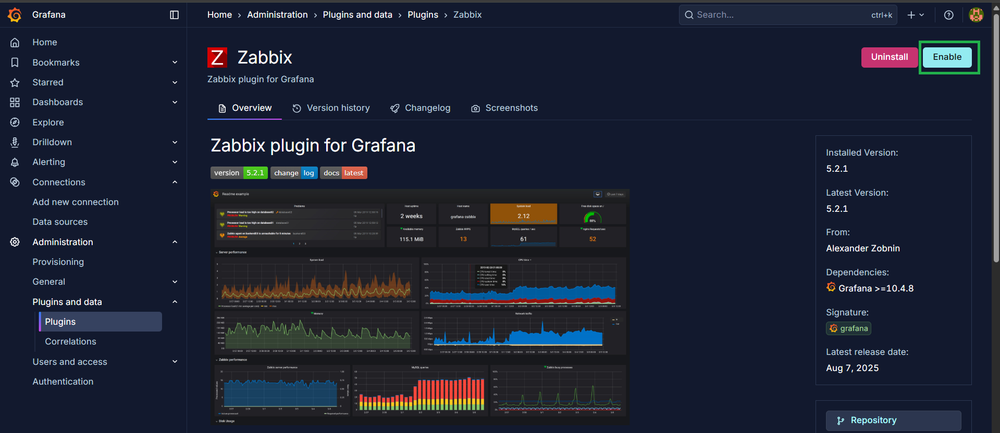

- **2. Open Data Sources Menu**
   - Click the **gear ⚙️ (Connection)** menu on the left sidebar.  
   - Select **Data Sources**.  
   - Click **Add data source**.
   - Search for **Zabbix** (the plugin installed in step 5).  
   - Click **Zabbix** → a configuration form will appear.

   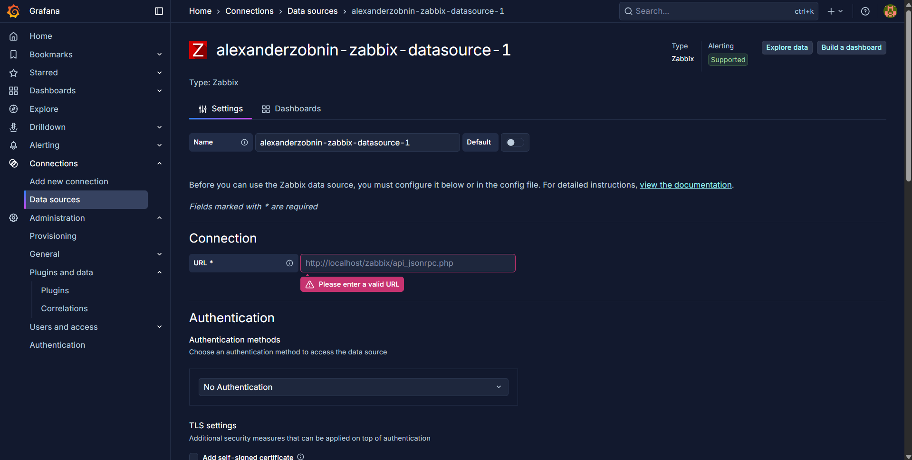

- **3. Configure API Connection**
   Fill in the details to connect Grafana with Zabbix Server (VM1):
   - **URL**   
    `http://<IP_VM1>/api_jsonrpc.php`  
   - **Access** → Select **Server** (safer, requests are made from Grafana server to Zabbix, not from user browser).
- **4. Enter Zabbix Credentials**
   In **Zabbix API details** section:
   - **Username**:  
   `Admin`
   - **Password**:  
   `zabbix` (default, unless you changed it in VM1 setup).
- **5. Advanced Options (Optional)**
   - **Trends** → enable this if you want Grafana to query aggregated trend data (faster for long time ranges).  
   - **Cache TTL** → configure caching for faster query response.
- **6. Save & Test**
   Click **Save & Test**.  
   If successful, you will see a green message:  
   `Data source is working ✅`

   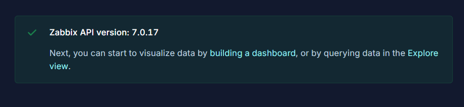

##### 6. Import Zabbix Dashboards into Grafana
Grafana + Zabbix plugin comes with prebuilt dashboards, but you can also import templates from Grafana.com Dashboards

Recommended Templates for Full Monitoring:
- Zabbix Host Monitoring (ID: 5363)
    → CPU, Memory, Disk, Network per host.

To import:
- Go to Grafana → Dashboards → Import → Enter Dashboard ID → Load → Select Zabbix Data Source → Import.

Result:
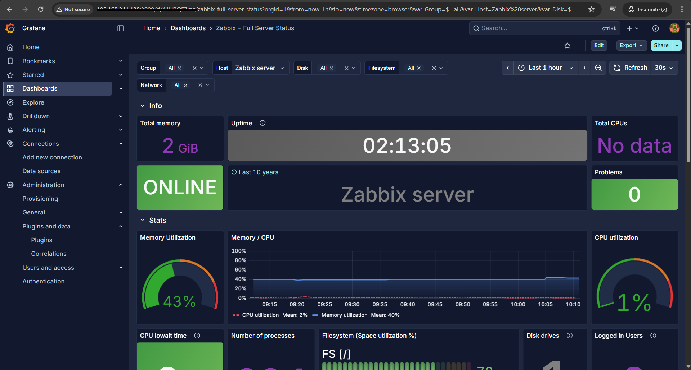

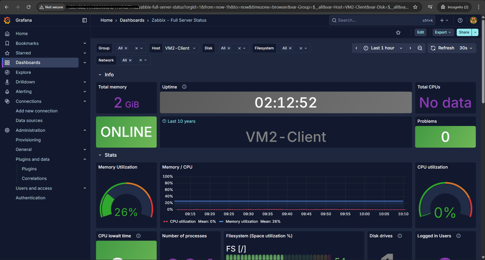

 

---

## 🔹 Conclusion  

✅ Summary (Flow from Scratch)

- VM1 (Zabbix Server) – Install Zabbix Server + Web + DB.
- VM2 (Zabbix Agent) – Install Agent, configure to send metrics to VM1.
- VM3 (Grafana) – Install Grafana, enable firewall, and start service.
- Install Zabbix Plugin in Grafana.
- Add Zabbix as Data Source in Grafana (via API).
- Import Dashboards from Grafana.com (using IDs above).

Enjoy full monitoring visualization 🎉 