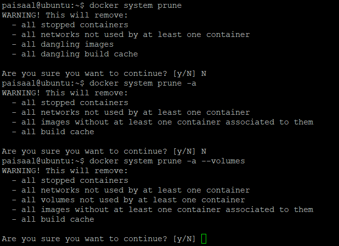
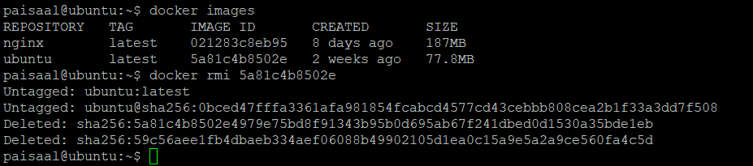

[Docker](https://www.docker.com/) is one of the most popular products in organizations these days. It makes the process of managing applications in containers very easy. Docker provides portability, performance, agility, scalability, and isolation to the applications since it uses containers. Containers are more portable and require fewer resources than virtual machines. As you work with Docker, you tend to accumulate an excessive number of unused images, volumes, and containers. These resources will clutter the output and consume a lot of disk space. In this tutorial, you will learn how to clean up Docker resources and organize your server.

# Purge All
You can clean all the Docker resources including images, stopped containers, volumes, and networks with a single command. You can choose one of the options below:

Reference: Dangling resources are the ones that aren’t related to any running container. 
* OPTION 1
    ```html
    docker system prune
    ```
    This will remove:
    -  all stopped containers
    -  all networks not used by at least one container
    -  all dangling images
    -  all dangling build cache

* OPTION 2
    ```html
    docker system prune -a
    ```
    This will remove:
    - all stopped containers
    - all networks not used by at least one container
    - all images without at least one container associated with them
    - all build cache

* OPTION 3
    ```html
    docker system prune -a --volumes
    ```
    This will remove:
    - all stopped containers
    - all networks not used by at least one container
    - all volumes not used by at least one container
    - all images without at least one container associated with them
    - all build cache



<br>

# Removing Docker Images
To remove a specific image, you need to know its image ID. You can find the image ID of a Docker container using the “docker images” command.
* List images:
    ```html
    docker images
    ```
* Remove image:
    ```html
    docker rmi <Image ID>
 
    Example: 
    docker rmi 5a81c4b8502e
    ```



### Removing Dangling Images:
When you build a Docker image, it generally has several layers of images. Dangling images are the layers that do not have any relation with any tagged image. Dangling images consume disk space but serve no purpose. They can be listed using the command:
```html
docker images -f dangling=true
```
You can remove these images by running the following command:
```html
docker image prune
```

### Removing images based on pattern
You can easily find images based on a particular pattern using the “grep” command and then remove them by passing it in the “docker rmi” command using “awk”. You can use the following commands and replace the “pattern” in each of them:
* LIST
    ```html
    docker images -a | grep "pattern"
    ```
* REMOVE
    ```html
    docker images -a | grep "pattern" | awk '{print $3}' | xargs docker rmi
    ```
* Remove all images
    You can list all the docker images by using the command:
    ```html
    docker images -a
    ```
Once you’ve decided to remove them all, you can use this command to delete them all:
```html
docker images -a -q | xargs docker rmi
```

<br>

# Removing Containers:
Now that you have cleared all the unnecessary images, it’s time to delete some of the containers which aren’t required.
To list the containers, you can use the command:
```html
docker ps -a
```
To remove the containers, use the command:
```html
docker rm <<Container Name/Container ID>>
```


### Running Containers Temporarily
If you want to run the container only once, you can choose to delete the container automatically once it exits. You can do so using the command:
```html
docker run --rm <<ImageName>>
```

### Removing exited containers
You can filter the exited containers using the “-f” argument.  List the exited containers using the command:
```html
docker ps -a -f status=exited
```
Now that you’ve filtered them, remove them using this command:
```html
docker rm $(docker ps -a -f status=exited -q)
```

### Removing containers based on pattern
You can easily find containers based on a particular pattern using the “grep” command and then remove them by passing it in “docker rm” command using “awk”. You can use the following commands and replace the “pattern” in each of them.
* LIST
    ```html
    docker ps -a | grep "pattern"
    ```
* REMOVE 
    ```html
    docker ps -a | grep "pattern" | awk '{print $1}' | xargs docker rm
    ```

### Stop and Remove All Containers
Before doing so, review all the containers on your server by listing them. Only once you’re sure that you want to delete them, run the following commands:

* List the containers to review:
    ```html
    docker ps -a
    ```

* Stop and Remove:
    ```html
    docker stop $(docker ps -a -q)
    docker rm $(docker ps -a -q)
    ```

<br>

# Removing Volumes
### Remove a specific volume
To remove a specific volume, you need to know the volume name. To find that out, you can list the volumes.

* LIST
    ```html
    docker volume ls
    ```
* REMOVE
    ```html
    docker volume rm <<VolumeName>>
    ```


### Remove Dangling Volumes
When you remove a container, the volume attached to it doesn’t get removed automatically. Such a volume is called dangling volume. To locate such volumes, use the filter argument in the command:
```html
docker volume ls -f dangling=true
```
To remove all such dangling volumes, use the command:
```html
docker volume prune
```

### Remove a container and its unnamed volume
If you created an anonymous or unnamed volume while running the container, you can remove it along with the container using a single command. However, if the volume is named then only the container would get deleted.
```html
docker rm -v <<ContainerName>>
```
<br>

Now that you have got this cheat sheet, you should be ready to clean up Docker resources that aren’t required on your server.