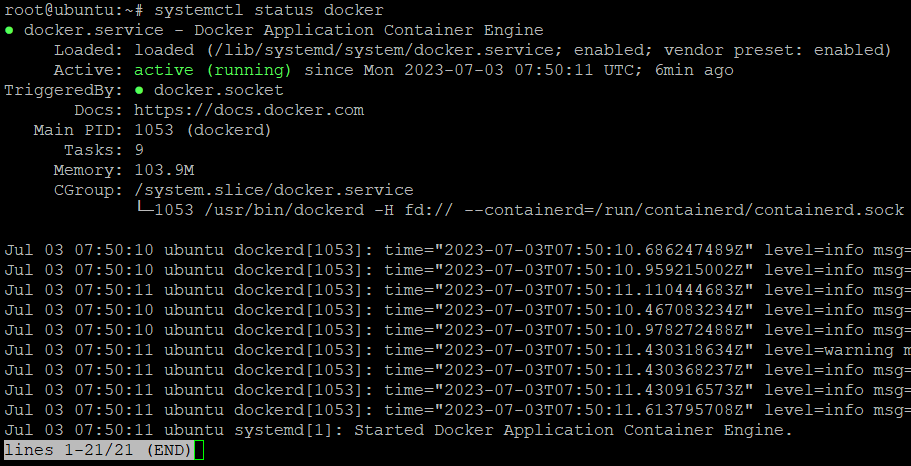
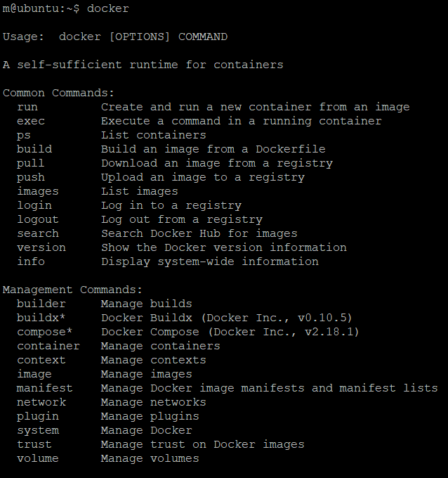
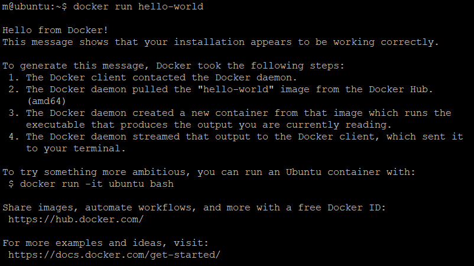
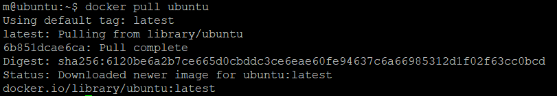
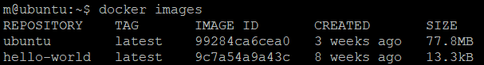
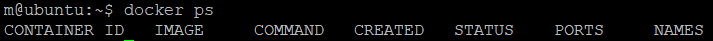
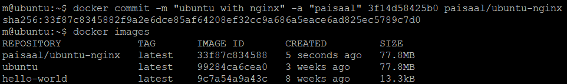
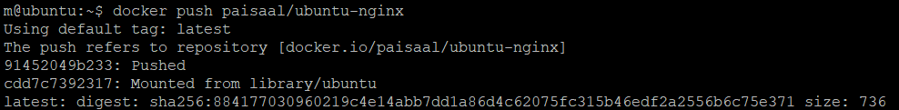

Docker is one of the most popular products in organizations these days. It makes the process of managing applications in containers very easy. Docker provides portability, performance, agility, scalability and isolation to the applications, since it uses containers, which are more portable and require less resources than virtual machines.

In this tutorial, you will go through the steps required to set up and use Docker on an Ubuntu server. You will start by installing and configuring Docker on your private server. You will then work with Docker images and containers. Finally, you will also push an image to the Docker repository.

# Step 1: Installing Docker on Ubuntu
There are various ways to install Docker on Ubuntu, but the most preferable one is installing Docker’s latest version from its official repository. In the current tutorial, we are going to use this method.

Before you start installing Docker, you need to set up its repository. After that, you can install Docker from the repository.

- First, you need to update the apt package index and install a few packages. These packages will allow apt to use a repository over HTTPS:

sudo apt-get update  

sudo apt-get install apt-transport-https ca-certificates curl gnupg-agent software-properties-common  



- Then, you need to add GPG key of the official Docker repository to your system:

sudo curl -fsSL https://download.docker.com/linux/ubuntu/gpg | sudo apt-key add -  


- You can verify the fingerprint by using the following command:

sudo apt-key fingerprint 0EBFCD88  


- Next, you go ahead and add the official repository using this command:

sudo add-apt-repository "deb [arch=amd64] https://download.docker.com/linux/ubuntu $(lsb_release -cs) stable"  


- Finally, you can install the Docker engine. The following commands first update the apt package index and then install the latest version of Docker engine and contained:

sudo apt-get update  
sudo apt-get install docker-ce docker-ce-cli containerd.io  


<br>

Docker is now installed and it’s daemon process has started. You can check the running status of Docker using the command:
```html
sudo systemctl status docker  
```



<br>

# Step 2: Providing Docker Permission to User
Currently, the Docker command can only be run by a root user or a user in the ‘docker’ group. The Docker group is automatically created during the Docker installation procedure. If you try to run the Docker command without sudo or from a user who hasn’t been added to the group, you will get an error.

You can add your user to the Docker group using the following command:
```html
sudo usermod -aG docker (your_username)  
```

<br>

# Step 3: Using the Docker Command
You can find the syntax of Docker command by just executing it:
```html
docker  
```

This will show you the usage and possible options and arguments you can use. For example:


You can see the available options for a specific sub-command using:
```html
docker docker-subcommand --help  
```

<br>

# Step 4: Working with Docker Images in Ubuntu
Docker containers are built using Docker images. Docker Hub is an official Docker registry. Anyone can register and host their Docker images there.
To test the access to Docker hub, try this command:
```html
sudo docker run hello-world  
```


It mentions that Docker was unable to find the image locally, so it pulled the image from Docker hub. Docker daemon created a new container from that image that runs the executable and prints this output shown in the image. The daemon then streamed the output to Docker client, which sent it to our terminal.

You can search for more images using the ‘docker search’ command. For example, you can search for Ubuntu operating system image by:
```html
docker search ubuntu  
```

It will search Docker hub for all images that contain ‘ubuntu’ and return the list to us. You can try pulling Ubuntu image using this command:
```html
docker pull ubuntu  
```


Now that the image has been downloaded, you can run a container with this image using the ‘docker run’ command. If you haven’t downloaded the image, the ‘docker run’ command will first download it and then run it as it did in case of our ‘hello-world’ example.

You can see the Docker images stored on your server by using the command:
```html
docker images  
```


Currently we have two images – ‘ubuntu’ and ‘hello-world’. Now let’s see how you can run containers using these images.

<br>

# Step 5: Running a Container
When we ran the hello-world container, it ran, executed some commands to display a message and exited. However, containers can also be used interactively as they are similar to virtual machines.

You can run the ubuntu container with “-it” which gives you an interactive shell access to the container.
```html
docker run -it ubuntu  
```

The command prompt will change to look a little different based on the container you are in.
```html
Output:  

root@3f14d58425b0:/#  
```

“3f14d58425b0” in the above shell is the container ID of the container which can be used to remove the container, if required.

Now that you are in the container, you can run various commands here just like you would do on a server. Let’s for example try to update your package database using this command:
```html
root@3f14d58425b0:/# apt update  
```

You can also install any application that you want to run. Let’s take Nginx, for instance. You can use the following command to do that:
```html
root@3f14d58425b0:/# apt install nginx  
```

You can run the Nginx service and check its status by means of these command lines:
```html
root@3f14d58425b0:/# service nginx start  
 * Starting nginx nginx                                           [ OK ]  
root@3f14d58425b0:/# service nginx status  
 * nginx is running  
```

Any changes that you make to the container are only applied inside that container. Those won’t be saved to the images. In the following steps, you will learn how to save those changes to create new images. Please type **exit** to exit the container.

<br>

# Step 6: Managing Container
In this part, you will learn to manage containers in Docker.

Once you start using Docker actively, you would generally have lots of containers and images on your system. You can view active ones using this command:
```html
docker ps  
```


But we did run two containers, “ubuntu” and “hello-world”. Where are they?
Since they are no longer running, you can’t see them here. However, you can get a list of all the containers – inactive and active – using the following command:
```html
docker ps -a  
```


You can start a stopped container using the command ‘docker start’ followed by container ID or container’s name. Let’s try running the Ubuntu container:
```html
docker start 3f14d58425b0  
```


To stop a container, use the command ‘docker stop’ followed by the container ID or container’s name.
```html
docker stop youthful_mclaren  
```

You can remove a container once your work is complete using the command ‘docker remove’.
```html
docker remove youthful_mclaren  
```

<br>

# Step 7: Commiting Changes to a Docker Image
Just like a virtual machine, you can make changes to the container such as removing a file, installing an application and configuring it for a use case. But the changes are only saved in that particular container. You can stop and start the container, but once you remove the container, the changes will be lost.

However, you can save the state of the container by creating a new Docker image out of it. Earlier, we installed an Nginx application on top of the Ubuntu container. You could save that image so that you don’t have to repeat the steps again. After making the changes, you can run a command of this format:
```html
docker commit -m "Change" -a "Author's Name" container_id repository/imageName   
```

Description:

- -m = Used to mention the change we made for reference so we and others can understand the change.
- -a = Used to mention the name of the author.
- container_id = Container ID of the container in which we made changes
- repository = Generally your Docker hub username
- imageName = Name of the new image

Example:
```html
docker commit -m "ubuntu with nginx" -a "your-username" 3f14d58425b0 your-username/ubuntu-nginx   
```

Here is how you can list the Docker images and see the saved Docker image:


As you can see, the new image with the name “ubuntu-nginx” is now in your system locally. The size difference between both is significant and this is due to the Nginx installation on top of the base image.

<br>

# Step 8: Pushing Docker Images to Docker Repository in Ubuntu
Now that you have created an image, let’s push it to the Docker repository so that it’s available to others. To do that, you should first have an **account** on [Docker hub](https://hub.docker.com/).

To push an image, you first need to login with the username:
```html
docker login -u <<userName>>  
```


You can push the image to the Docker hub repository using the command:
```html
docker push <<dockerHub-username>>/ubuntu-nginx  
```


After pushing the image to the repository, it will be listed under the account:


Now, you can pull the image from any server which has access to Docker hub.

Now that you have the basics, you can start using Docker for trying new applications, doing experiments and deploying various services on the cloud.