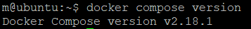
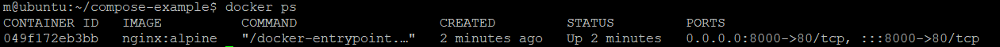
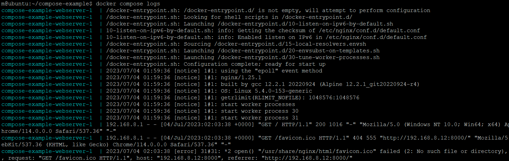
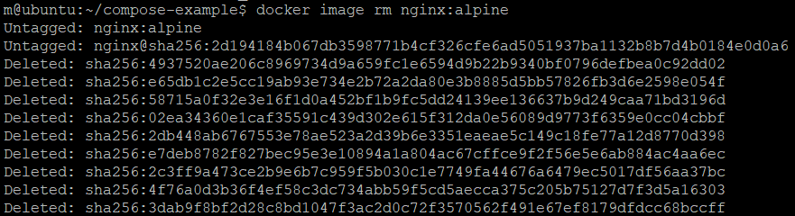

Containerization has greatly picked up momentum in the software tech space over recent years. This can be attributed to Docker which is a container platform that simplifies the management of processes inside containers.

Containers are lightweight, virtualized, portable, software-defined standardized environments that allow the software to run in isolation from other software running on the physical host machine. This portability feature allows developers to modularize their applications into isolated services. Furthermore, it can be served independently giving room for scaling.

While splitting an application into multiple services is definitely great, it comes with the overhead of managing several containers. You have to ensure they communicate, start and shut down at the same time. Thanks to a tool called Docker Compose, this becomes an easy task. Docker Compose allows developers to run multi-container Docker applications using rules defined in a YAML file. The YAML file contains definitions for the application services and how they can share data volumes and networks. Once you have defined the services, you can fire up all of them with a single command. In this tutorial, we will show you **how to install, configure, and get started with Docker Compose on Ubuntu 20.04**.

# Prerequisites
- As this is a hands-on tutorial, you should have an installation of Ubuntu 20.04 as your initial operating environment. You should also have a non-root user with sudo privileges.

- You also need to install Docker.

# Step 1: Installing Docker Compose
We will be downloading the latest stable version of Docker Compose from its [official GitHub repository](https://github.com/docker/compose). You can find out the latest version from the releases page, at the time of writing this tutorial, the latest version is 2.18.1.

First, log in to your Ubuntu server with the non-root sudo user and enter the following command. It downloads the latest release (2.18.1). This makes it globally accessible as docker-compose:
```html
DOCKER_CONFIG=${DOCKER_CONFIG:-$HOME/.docker}
mkdir -p $DOCKER_CONFIG/cli-plugins
curl -SL https://github.com/docker/compose/releases/download/v2.18.1/docker-compose-linux-x86_64 -o $DOCKER_CONFIG/cli-plugins/docker-compose   
```

Once it has downloaded, enter the following command to set the appropriate permissions for the docker-compose command to be executable:
```html
chmod +x $DOCKER_CONFIG/cli-plugins/docker-compose
```

Now, verify that the installation is a success and the command can be invoked by running the following command:
```html
docker compose version
```

You should get an output like this:  


This confirms that Docker Compose has been successfully installed on your system.

<br>

# Step 2: Creating the docker-compose.yml File
To help you understand how to work with docker-compose.yml, we will configure a web server environment using the official Nginx image from Docker Hub. Once deployed, we should be able to serve a basic HTML page from the container.

We will create our working directory in the home folder where we will be working from. Enter the following command to create & move into the directory:
```html
mkdir ~/compose-example
cd compose-example
```

Once inside the directory, create an application folder that will be the document root for the Nginx environment. We can call this folder **app**, and creating an HTML page: 
```html
mkdir app
nano app/index.html
```

Next, add the following HTML code to the file:
```html
<!DOCTYPE html>  
<html lang="en">  
<head>  
    <meta charset="UTF-8">  
    <meta name="viewport" content="width=device-width, initial-scale=1">  
    <meta name="description" content="">  
    <meta name="generator" content="Hugo 0.80.0">  
    <title>Docker Compose Example</title>  
    <!-- Bootstrap core CSS -->  
    <link href="https://cdn.jsdelivr.net/npm/bootstrap@5.0.0-beta2/dist/css/bootstrap.min.css" rel="stylesheet" crossorigin="anonymous">      
</head>  
 <body>  
  <main>  
    <section class="py-5 text-center container">  
        <div class="row py-lg-5">  
            <div class="col-lg-6 col-md-8 mx-auto">  
                <h1 class="fw-light">Docker Compose Example</h1>  
                <p class="h4"> This is a basic static HTML page. </p>   
                <p class="lead text-muted"> This page is being served from an Nginx Docker Container built using <b>docker-compose</b></p>    
            </div>
        </div>
    </section>
  </main>
</body>
</html>
```

To save the file, press CTRL +O, ENTER. Then, close with CTRL +X. Next, we will create the **docker-compose.yml** file inside our project root.

Next, enter the following command to open the file with nano editor:
```html
nano docker-compose.yml
```

After that, add the following code snippet inside the file:
```html
version: '3.8'
services:
 webserver:
  image: nginx:alpine
  ports:
   - "8000:80"
  volumes:
   - ./app:/usr/share/nginx/html
```

The **docker-compose.yml** file begins with the version number that tells Docker Compose which configuration version we are using. Please follow this link to learn more about [Docker Compose versioning](https://docs.docker.com/compose/compose-file/compose-versioning/).

After the version number, we have the services block that contains the services that make up the environment. In this tutorial, we have only specified a single service called webserver. The webserver service will use the nginx:alpine image. We have also defined the port redirection 8000:80. What this means is that all requests from port 8000 on the host machine will be redirected to the webserver container on port 80, where Nginx is running.

The volumes directive allows you to create a shared volume between the host machine and the container that we can use to persist data. In our yml code snippet, we share the local app folder with the container. Inside the container, it will be placed at the /usr/share/nginx/html location. Hence, it is overwriting the default document root for Nginx. You can save and close the file now.

Up to this point, you have created your example HTML web page and the docker-compose.yml file with instructions to build a containerized web server environment. Let’s see how we can fire up this setup in the next step.

<br>

# Step 3: Executing the Docker Compose Command
In this step, we will run the command to launch our containerized environment. Below is the single command that will initialize the download process of the Docker images, create a container for the webserver service and launch the containerized environment in the background:
```html
docker compose up -d
```

Docker is designed to be fast and efficient, so, when you run the above command, it first checks your local system for the defined image. If it is missing, it will then get it from the Docker Hub repository. It should show an output similar to this:


When the command finishes executing, it will start the container environment running in the background. You can verify that it is running using the command:
```html
docker ps
```

You should get a similar output:


If you navigate to your server’s IP address or domain name and add the port 8000, i.e. server_domain_or_IP:8000 you should be able to see the example HTML page that we created:


If you remember, we set up a shared volume between the container and the host system. This keeps the files in the container synchronized with the files on the host system. Hence, if you make a change to the index.html file, it syncs with the container automatically and is reflected when you reload the page in the browser. You can try with the nano editor. Let’s learn some more commands in the next step.

<br>

# Step 4: Additional Docker Compose Commands for Managing Container Environments
Now that you have successfully deployed a web page using the single docker-compose-up command, let’s see some additional commands that can be useful in managing containerized environments.

We’ll start with the logs command. Logs can be crucial when you are troubleshooting your application failures. First, run the following command to view the logs produced by the Nginx container:
```html
docker compose logs
```

Here is a sample output of the logs:


You can pause the environment execution without changing the state of the containers using the command:
```html
docker compose pause
```

Next, to unpause or resume executions use the command:
```html
docker compose unpause
```

You may want to stop the containers without destroying their data. In order to do that, use the following command:
```html
docker compose stop
```

To destroy the containers, networks, and volumes associated with the containerized environment, use the command:
```html
docker compose down
```

Keep in mind that the above command does not remove the base images used by Docker Compose to launch the environment. This ensures quicker builds when you fire up your environment, as it checks the local machine for matching images. If you would like to completely remove the base image, you must specify it in the command. For our example, we can remove the nginx:alpine image using the command:
```html
docker image rm nginx:alpine
```


Finally, you may find more commands from the official [Docker Compose Command-line reference](https://docs.docker.com/compose/reference/) docs.

## Conclusion
In this tutorial, you installed Docker Compose on Ubuntu 20.04, created a containerized environment based on an Nginx web server image, and learned how to manage the various services using Docker Compose Commands.
