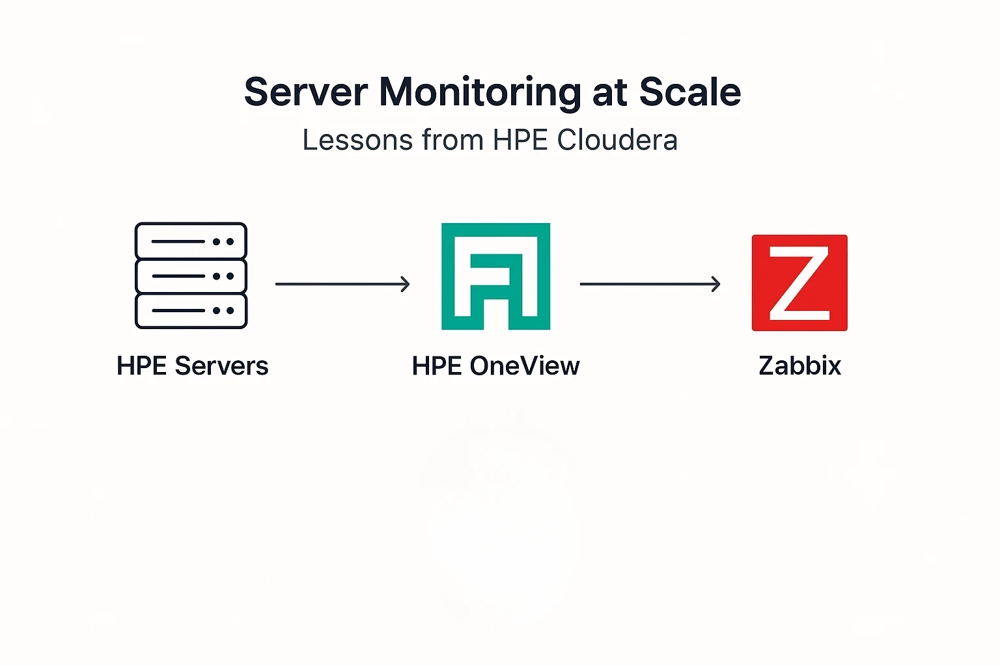

---
<<<<<<< HEAD
title: "Lessons Learned from Monitoring 112+ HPE Servers"
date: 2026-06-15
=======
title: "Server Monitoring at Scale – Lessons from HPE Cloudera"
date: 2025-08-01
>>>>>>> 5ba48d77e2358725c8e7fed48c45728fe417fd1c
draft: false
tags: ["Monitoring", "HPE", "Cloudera", "OneView", "DevOps", "SysAdmin"]
---

<<<<<<< HEAD
As part of a Managed Services & Operational project at PT. Bringin Inti Teknologi (BIT), I have been involved in operating and monitoring more than 112 HPE servers running in an enterprise Cloudera environment.

The infrastructure was primarily monitored using HPE OneView and iLO, while Grafana and Zabbix were used to collect metrics, visualize resource utilization, and support operational analysis.

---

## My Responsibilities

My daily responsibilities included:

* Monitoring and maintaining 112+ HPE servers using HPE OneView and iLO
* Installing and administering Red Hat Enterprise Linux (RHEL)
* Investigating hardware alerts and system events
* Troubleshooting operating system and networking issues
* Deploying and configuring Zabbix Agents
* Integrating servers into the monitoring platform
* Performing HPE iLO firmware upgrades
* Collecting infrastructure logs and utilization metrics
* Generating CPU and memory utilization reports
* Supporting server maintenance and operational activities

---

## Monitoring Beyond Dashboards

One of the lessons I learned during this project is that infrastructure monitoring is much more than simply watching dashboards.

Daily monitoring activities involved reviewing server health, checking hardware status, analyzing logs, and ensuring that systems remained stable and available.

For deeper hardware investigation, iLO provided access to server diagnostics, hardware event logs, sensor information, and remote management capabilities.

---

## Common Hardware Alerts

Several hardware-related issues were encountered during daily operations, including:

### Disk Failures

Storage alerts often indicated degraded disks or potential hardware failures. These situations required verification and coordination for component replacement.

### NIC Failures

Network Interface Card failures could impact server connectivity and service availability. Troubleshooting was required to identify affected interfaces and validate network functionality after maintenance.

### SFP Module Issues

Faulty or disconnected SFP modules occasionally generated alerts that required inspection and replacement to restore stable network communication.

---

## Capacity and Utilization Reporting

Besides monitoring server health, I frequently received requests to analyze infrastructure utilization and prepare monthly operational reports.

These reports typically included:

* Top 10 servers with the highest CPU utilization
* Top 10 servers with the highest memory utilization
* Monthly resource utilization trends
* Infrastructure growth and capacity observations

To produce these reports, I collected and analyzed data from Grafana and HPE OneView.

The information helped teams understand resource consumption patterns, identify heavily utilized systems, and support future capacity planning decisions.

---

## Additional Operational Activities

Beyond monitoring activities, I also participated in several infrastructure maintenance tasks:

* Upgrading HPE iLO firmware
* Installing and configuring Zabbix Agents
* Registering monitored servers into the Zabbix platform
* Validating monitoring data collection after deployment
* Supporting server maintenance activities

These tasks helped improve monitoring visibility and maintain operational consistency across the infrastructure environment.

---

## A Real-World Troubleshooting Experience

One operational challenge occurred during an operating system upgrade where an existing network bonding configuration became detached from its associated interfaces.

After reviewing the network configuration, the issue was resolved by reconfiguring the bonding setup using nmcli commands and validating connectivity after the changes were applied.

This experience reinforced the importance of understanding Linux networking in addition to infrastructure monitoring.
=======
As part of a **Managed Services & Operational project at PT. Bringin Inti Teknologi (bit.)**,  
I had the opportunity to work on **monitoring more than 112 HPE servers** that were used in a Cloudera environment.  
The monitoring was performed using **HPE OneView**, along with supporting tools like **Zabbix**.  

---

## Key Responsibilities
During this project, my main tasks included:

1. **Basic Server Setup**  
   Installing and configuring Red Hat Enterprise Linux (RHEL) as the primary operating system.  

2. **Monitoring & Health Check**  
   Setting up monitoring for 112 HPE servers using **HPE OneView**, ensuring that CPU, memory, storage, and network utilization were tracked in real-time.  

3. **Alerting & Event Management**  
   Configuring alerts and log collection to quickly identify failures, bottlenecks, or hardware degradation.  

4. **Integration with Monitoring Tools**  
   Complementing OneView data with **Zabbix** dashboards for better visualization and trend analysis.  

---

## Tools & Technologies
- **HPE OneView** → Infrastructure and hardware monitoring.  
- **Red Hat Enterprise Linux (RHEL)** → Operating system for most of the servers.  
- **Zabbix** → Visualization, metrics collection, and alerting.  
- **Cloudera** → The main platform running on top of these servers.  
>>>>>>> 5ba48d77e2358725c8e7fed48c45728fe417fd1c

---

## Key Takeaways
<<<<<<< HEAD

Working in a large-scale enterprise infrastructure environment taught me several valuable lessons:

* Monitoring requires understanding hardware, operating systems, networking, and troubleshooting processes.
* Early detection of hardware issues helps reduce downtime and operational risks.
* Capacity monitoring is important for identifying resource trends and planning future growth.
* Tools such as HPE OneView, iLO, Grafana, and Zabbix provide complementary visibility into infrastructure health.
* Reliable infrastructure depends on consistent monitoring, maintenance, and operational discipline.

This experience strengthened my skills in infrastructure operations, Linux administration, hardware troubleshooting, monitoring systems, and capacity analysis. It also gave me a deeper understanding of how enterprise environments maintain reliability and performance at scale.
=======
Working on a large-scale monitoring environment taught me several important lessons:

- **Scalability matters** – Managing more than 100 servers requires automation and consistent monitoring policies.  
- **Clear documentation** – With multiple engineers on the project, documenting monitoring procedures was essential.  
- **Proactive alerting** – Early detection of hardware issues prevents downtime and reduces business impact.  
- **Cross-tool integration** – Combining HPE OneView with Zabbix provided both low-level hardware visibility and high-level metrics visualization.  

---

This experience strengthened my skills in **infrastructure monitoring, incident response, and system administration**.  
It also gave me a deeper understanding of how large-scale enterprise environments maintain reliability and performance through proactive monitoring.  
>>>>>>> 5ba48d77e2358725c8e7fed48c45728fe417fd1c
