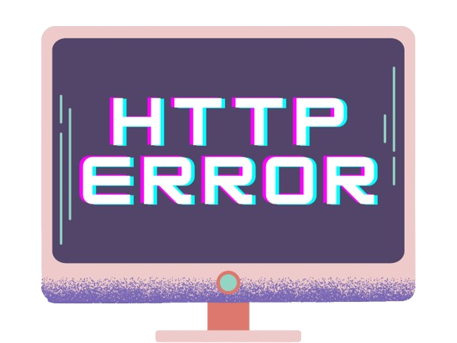
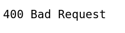
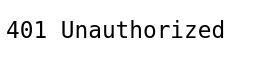
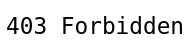
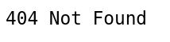
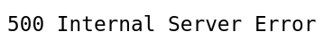
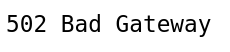
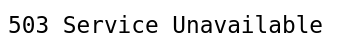

Any web server receiving an HTTP request is responded to with an HTTP status code. These codes are short notes from the server describing the situation. It doesn’t contain any actual site content. Instead, it’s a report of how things went after receiving the HTTP request. In many situations, these codes are important to diagnose various server/client issues.

These codes are three-digit long integers, each signifying various statuses. Based on the first digit, HTTP codes are divided into five categories:
- Information responses: Value ranges from 100 to 199. It describes that the request was received and being processed.
- Successful responses: Value ranges from 200 to 299. It says that the action was received, understood, and accepted successfully.
- Redirection messages: Value ranges from 300 to 399. It means that further actions are necessary to complete the request.
- Client error responses: Value ranges from 400 to 499. Either the request contains incorrect syntaxes or it can’t be fulfilled.
- Server error responses: Value ranges from 500 to 599. It means that the server failed to process a valid request.

In this guide, we will discuss some of the most common HTTP error codes that everyone encounters (4xx and 5xx), from the perspective of a system admin. Numerous situations can lead the webserver to respond with a particular code. In addition, this tutorial will discuss potential causes and solutions.

 

# Client vs Server Errors
Error codes 400 to 499 result from the user client (a web browser or any HTTP client). Although the errors are mostly client-related, it’s useful to know which code a user is experiencing. It can help determine if a potential issue can be deployed on the server-side.

Server errors (HTTP status code 500 to 599), on the other hand, result when the server is aware that an error has occurred or is not able to process the request.

 

# General Troubleshooting
Irrespective of the error, here are some general troubleshooting tips that you should test out first whenever facing any HTTP error code:
- When using a web browser to test the server, it’s a good practice to refresh the browser after making any change to the server.
- The server log holds detailed info about how the server is handling the requests. For example, popular web servers like Apache and Nginx produce files access.log and error.log. Checking these logs can reveal useful info.
- HTTP error codes are part of a standard. The programs are implementing this standard based on how they handle the requests. It means that a particular status code is returned on how the server software is handling the particular error.

This guide should serve as a useful guideline in figuring out the source of the issue.

 

# Common HTTP Error
### Common Client Errors

The error code 400 indicates a Bad Request. It describes that the HTTP request sent to the server contains invalid syntax. Let’s have a look at potential sources of the bad syntaxes:
- The site-related cookies may be corrupted. Cleaning the browser cookies and cache may solve the issue.
- The web browser sending the request may be faulty/buggy.
- It could be a bad request due to an error when manually forming HTTP requests, for example, incorrect usage of curl.

 

The error code 401 (Unauthorized) occurs when the request is trying to access the resources that were not authenticated or authenticated correctly. To solve the issue, the user must provide the necessary credentials to access the protected resource.

An example situation would be when the user is trying to access a resource protected by HTTP authentication. In such a situation, the user will receive an error 401 code unless a valid username and password are provided.

 

The error code 403 (Forbidden) refers to a situation when the user request is valid but the server refuses to serve the request. It can be because of a lack of permission to access the requested resource. There are a few scenarios that can lead to this issue:
- File permissions: If the server doesn’t have sufficient permission to access the requested file, it can result in a 403 error. Possible fixes include verifying that the server is trying to access the webserver’s index file, the worker process owned by www-data user, and the index file is located at the right location (in the case of Nginx, it’s /usr/share/nginx/html/index.html).
- .htaccess: Web servers use the .htaccess file to implement various security features, for example, filtering specific IP addresses or ranges. A possible fix involves verifying that the IP address the HTTP request is coming from isn’t blocked.
- File does not exist: If the request is trying to access a location that has no default index file and the directory listings aren’t enabled, the server will return the 403 error. In such a situation a possible fix involves tweaking the server configuration to allow directory listings.

 

The error code 404 (Not Found) means that the user was able to connect to the webserver successfully but was not able to locate the requested resource. This error may appear in a number of situations. Here are some possible troubleshooting actions:
- Check for any potential typographical error in the link that directed the user to the server resource.
- The user could have typed the URL wrong. Check if this is the case, and correct it if necessary.
- Verify the existence of the file on the server. Was it moved or deleted from the server?
- The server may be configured with the wrong document root location. Check for that, and fix if appropriate.
- Does the user-owned web server worker process have permission to traverse the file requested? Note that it requires having both read and execute permissions to access a directory.
- Is the resource a symbolic link? In that case, the server must be configured to follow symbolic links.

### Common Server Errors

The error code 500 (Internal Server Error) occurs when the server is unable to process the request for unknown reasons. In some situations, the server will report error 500 when a more specific 5xx error code would be appropriate.

One of the most common sources of error 500 is a misconfigured server, for example, a malformed .htaccess file. It can also rise if there are missing packages, for example, trying to run PHP codes without having PHP installed on the system.

 

The error code 502 (Bad Gateway) says that the server is a proxy or a gateway and it can’t reach a valid response from the backend server (responsible for actually fulfilling the request). If the server is a reverse proxy, for example, a load balancer, there are a couple of different things to check for:
- The backend servers are healthy.
- The reverse proxy is properly configured (with proper backend specifications).
- The connection between the reverse proxy and the backend server is healthy. If the servers can communicate using different ports, then the firewall must allow the connection to those ports.
- If the web app is configured to use a socket, ensure that the socket exists in the right location with proper permissions.

 

The error code 503 (Service Unavailable) describes that the server is experiencing overload or is currently under maintenance. It implies that the server should become available at some point.

If the server isn’t under maintenance, then it indicates that the server doesn’t have the necessary hardware resources (processing power, memory, etc.) to handle the incoming requests. In such a case, the server should be configured to allow more users or allocate more resources.

The error code 504 (Gateway Timeout) tells that the server is a proxy or a gateway server and it didn’t receive a response from the backend within the allowed time window. There are several situations that can lead to this issue:
- A bad network connection between the servers.
- The backend server is performing too slowly (because of performance issues). 
- The gateway/proxy server timeout limit is too tight.

 

## Final Thoughts
This guide discusses HTTP error codes, especially some of the most common ones. It describes what the codes mean and gives suggestions for potential troubleshooting actions. With this knowledge, you now have a solid basis for troubleshooting issues with your web servers or applications.