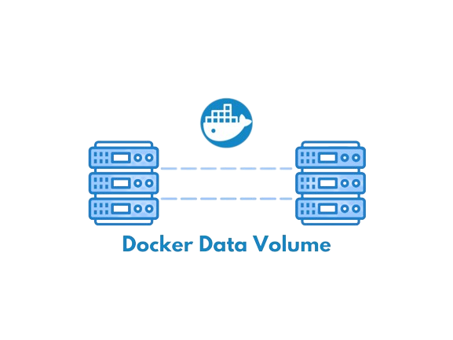
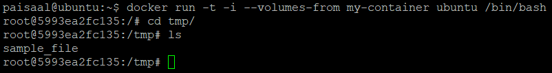

[Docker Data Volumes](https://docs.docker.com/storage/volumes/) is an important concept when containerizing your applications. Knowing this concept is vital for ensuring the best experience of your containerized application along with reliable persistence and data management. However, while this concept is important, it is also confusing and complex for many developers. It is important for developers and DevOps specialists to be able to understand how to set up Docker Data Volumes, understand their correct usage, know the different types of volumes and which type to select for their application.

This tutorial is focused on **explaining the concept and usage of Docker Data Volumes**. After you have completed this tutorial, you would have mastered setting up and working with any type of Docker Data Volume.

# Prerequisites
To follow along with this tutorial you will need to have the below items:

- Ubuntu user with sudo privileges. This step can be complicated especially if you are not familiar with Linux. Read Configuring the Linux Sudoers File for a detailed guide.
- Docker installed on Ubuntu. In order to install Docker on your Ubuntu you can follow our [How to install & operate Docker on Ubuntu](https://nurfaisal.my.id/posts/how-to-install-operate-docker-on-ubuntu/) blog.

While this tutorial focuses on managing Docker on Ubuntu, docker commands are applicable across all operating systems with Docker installed.
<br>

# Understanding How Docker Containers Work
To fully understand Docker Data Volumes, you must know how Docker containers work. In this section, we provide a go-through of the basics for the new users of Docker. If you are aware of how Docker works or are an experienced user of Docker, you can skip this section and get started with data volumes.

Docker containers allow executing an application on top of the host operating system by installing the Docker platform. Because the Docker platform is installed on the host operating system, an abstraction is formed between the host machine and the guest application. Unlike a virtual machine, a Docker container shares its Linux kernel with the host operating system. Since Docker does not need any additional operating system to be installed on top of the host machine, Docker applications are lightweight and accessible across all the host machines as long as Docker is installed on that host machine.

As there is no additional guest OS, the Docker platform shares resources with the host machine. Firing up the Docker application is quick but complexity arrives when you have to share the resources. Docker does not have its memory or storage for data persistence. These resources have to come from the host machine. People accustomed to using virtual machines find this process of sharing and management of resources difficult. Not having proper knowledge can lead to unexpected and undesired outcomes.

<br>

# Persisting Data Using Docker Data Volumes
When working with Docker, you cannot create a volume inside it directly. Hence, to store data we need to create a Docker volume container with a volume attached to it. To connect our Docker application with this data volume container, we use Docker’s *--volume-from* command to get the container and attach it to our application.

We will go over the process step by step:

1. First, create a new container called, my-container by running the below command:
    ```html
    docker create -v /tmp --name my-container ubuntu
    ```
    
    This will create a new container in the /tmp folder. You can change the folder directory as needed.

2. Now that your data container is ready, you can write to it by running a new Ubuntu container with the --volume-from flag and then running the bash. Anything we write to the tmp directory will be saved in our host machine’s /tmp folder:
    ```html
    docker run -t -i --volumes-from my-container ubuntu /bin/bash
    ```
    
    **-t** command line option calls a terminal from inside the container. The -i flag makes the connection interactive. At the bash prompt for the Ubuntu container, create a file in /tmp:
    ```html
    echo "Some sample data" > /tmp/sample_file
    ```

3. Finally, exit this bash by running the exit command. Next, run the below command:
    ```html
    docker run -t -i --volumes-from my-container ubuntu /bin/bash
    ```
    
    You will find your **sample_file** in this directory. There is no restriction on the number of volumes to specify. You can add as many volumes as you want using the **--volumes-from** flag. You can also create as many data volume containers as you’d like.

# Accessing Data Between the Host and Docker Container
For readers experienced with Virtualization, this option is similar to the shared folder option in virtual machines. Here instead of creating a data-only container, we run our Docker application using Docker image and override one of its directories with the contents of a directory on the host system.

A common scenario would be to save the log files in the host machine. This might be needed so that we can analyze these files as needed without having to go inside the machine. For this scenario suppose you are using the Docker Nginx image and you want to store its log files in the host machine. Nginx Docker image writes the logs to the /var/log/nginx directory, but this is /var/log/nginx inside the Docker Nginx container. Thus, this location is not accessible to the host machine.

To achieve our goal, we would need to create a shared folder to store the logs between the host machine and the Docker Nginx image. Below we will illustrate this process in an easy step-by-step guide:

1. First, create a directory in your host machine where you want to store the logs:
    ```html
    mkdir ~/my-nginxlogs
    ```
    Then, start your container by running the below command:
    ```html
    docker run -d -v ~/my-nginxlogs:/var/log/nginx -p 5000:80 -i nginx
    ```
    

2. This run command is accepting a few arguments, so let’s break it down to understand better:
    - **-p 5000:80** = Setup a port forward. The Nginx container is listening on port 80 by default, and this maps the Nginx container’s port 80 to port 5000 on the host system.
    - **-d** = Detach the process and run it in the background
    - **-v ~/my-nginxlogs:/var/log/nginx** = We link the /var/log/nginx directory from inside the Nginx container to the /my-nginxlogs directory on the host machine. This : splits the host’s path from the container path. The host path always comes first.


Now that our Nginx container is running, first check if the Nginx server is serving at our host machine’s 5000 port by opening your web browser and running the URL: **http://localhost:5000**. Once the welcome page appears, your Nginx server is ready and is creating logs in its /var/log/nginx folder.

If you open your host machine’s /my-nginxlogs folder, you will see the log files here from the Docker Nginx container. If you make changes to the /my-nginxlogs folder on the host machine, while the Nginx container is running, changes will be reflected in the container’s /var/log/nginx folder as well.

## Conclusion
In this tutorial, we took a comprehensive approach towards understanding Docker Data Volumes. We looked at creating volumes for your application, sharing data between host and Docker container, types of data, and persisting data. This will help you in persisting data in your containerized applications as well as managing the state and configuration of the application.


