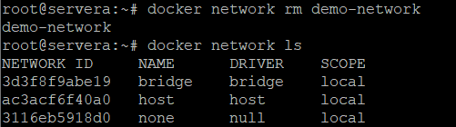

Docker Networking allows you to create a Network of Docker Containers managed by a master node called the manager. Containers inside the Docker Network can talk to each other by sharing packets of information. In this article, we will discuss some basic commands that would help you get started with Docker Networking.

# Introduction
A network is a group of two or more devices that can communicate with each other either physically or virtually. The Docker network is a virtual network created by Docker to enable communication between Docker containers. If two containers are running on the same host they can communicate with each other without the need for ports to be exposed to the host machine. You may use Docker to manage your Docker hosts in any platform manner, regardless of whether they run Windows, Linux, or a combination of the two.


# Network Drivers
There are several default network drivers available in Docker and some can be installed with the help of plugins, Command to see the list of containers in Docker mentioned below.
```html
docker network ls
```

#### Types of Network Drivers
1. **bridge**: The Bridge driver is the default network driver in Docker. When you create a container without specifying a network driver, Docker automatically uses the Bridge driver. It creates a bridge network, which is an internal network isolated from the host. Containers running in bridge mode can communicate with each other and with the host, but they cannot be accessed directly from outside the Docker environment. 
2. **host**: With the Host driver, containers use the network interface of the host directly. This means containers and the host share the same IP address, and containers can be accessed from outside using the host's IP address. While easy to set up, this approach reduces isolation between containers and the host.
3. **none**: With the None driver, containers are not connected to any network, which means they run in total isolation and have no access to the host's network or any other network.
4. **overlay**: The Overlay driver enables containers on different hosts to communicate seamlessly and transparently. This is particularly useful in environments with multiple Docker hosts running on separate physical machines.
5. **macvlan**: The MACVLAN driver assigns unique MAC and IP addresses to containers, allowing them to communicate directly with the host and other devices on the network. This driver is suitable for scenarios where you want containers to have accessible IP addresses from outside the Docker environment.

These network drivers allow Docker to provide a flexible and scalable networking environment, making it easier to manage communication between containers and the host or external networks. The choice of network driver depends on the specific requirements of your applications and the level of isolation and networking functionality you need for your Docker environment.

<br>

# Launch a Container on the Default Network
#### 1. Understanding the Docker Network Command 
The Docker Network command is the main command that would allow you to create, manage, and configure your Docker Network. Let’s see what the sub-commands can be used with the Docker Network command.
```html
docker network
```

We will see all the Network sub-commands one by one.

#### 2. Using Docker Network Create Command
With the help of the “Create” command, we can create our own docker network and can deploy our containers in it. 
```html
docker network create --driver <driver-name> <bridge-name>
```


#### 3. Using Docker Network Connect Command
Using the “Connect” command, you can connect a running Docker Container to an existing Network.
```html
docker network connect <network-name> <container-name_or_id>
```
In this example, we will connect an Nginx Container to the Bridge Network we created in the last step.


#### 4. Using Docker Network Inspect Command 
Using the Network Inspect command, you can find out the details of a Docker Network.
```html
docker network inspect <network-name>
```


You can also find the list of Containers that are connected to the Network.


#### 5. Using Docker Network ls Command 
To list all the Docker Networks, you can use the list command.
```html
docker network ls
```


#### 6. Using Docker Network Disconnect Command 
The disconnect command can be used to remove a Container from the Network.
```html
docker network disconnect <network-name> <container-name>
```


#### 7. Using Docker Network rm Command
You can remove a Docker Network using the rm command.
```html
docker network rm <network-name>
```
Note that if you want to remove a network, you need to make sure that no container is currently referencing the network.


#### 8. Using Docker Network Prune Command
To remove all the unused Docker Networks, you can use the prune command. 
```html
docker network prune
```


<br>

# Common Operations
* docker network inspects:  We may examine the configuration information of a specific network, such as the name of the network, the containers that have linked to this network, the type of driver used to construct this network, and other characteristics, by using the “docker network inspect” command.
* docker network ls: We can see all of the networks that are available on the current host by using “docker network ls”. 
* docker network creates: Using the command “docker network create” and the name of the driver, such as bridge, overlay, or macvlan, we can establish a new network. 
* docker network connects: In order to use this command, we must first confirm that the appropriate network has already been formed on the host. Then, using docker “network connect”, we may attach the container to the necessary network.

<br>

# Conclusion
Only with the aid of the IP address, gateway, routing table, DNS service, and any other networking information can the container learn what network interface is being used. The type of network associated with a container is unknown; it might be any driver, such as “bridge, host, and null.”