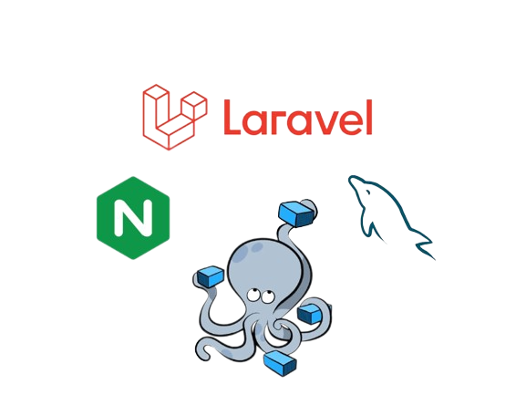

# Introduction
Continuous Integration (CI) and Continuous Deployment (CD) are some of the most trending topics in software development currently. To achieve the CI/CD aspect of software architecture, developers make use of containers. [Containers](https://www.docker.com/resources/what-container/) are lightweight, virtualized, portable, software-defined environments. In containers, the software can run in isolation of other software running on the physical host machine. The focus of this tutorial is on using the container platform Docker to deploy and run web applications. Docker helps to streamline the setup process of a web server stack. In this tutorial, we will use the LEMP stack to serve a Laravel application.

The LEMP stack combines Linux as the operating system, [Nginx](https://nginx.org/en/) as the webserver, [MySQL](https://dev.mysql.com/doc/) as the database, and [PHP](https://www.php.net/docs.php) language for scripting and dynamic processing. You can follow our tutorial on how to install and configure a LEMP stack on Ubuntu. Laravel is one of the top PHP frameworks for developing web applications.

Docker provides a tool called [Docker Compose](https://docs.docker.com/compose/) for defining the setup process of a docker container. Docker Compose allows developers to define the infrastructure of their application, services, volumes, networks, and any dependencies in one file called the docker-compose file. It can manage multiple Docker containers through its commands such as docker container create, docker container run, etc.

In this tutorial, you will learn how to deploy a Laravel web application with Nginx and MySQL inside a Docker container. The configurations for the entire stack will be defined inside a docker-compose file, as well as other configuration files for PHP, MySQL, and Nginx. Let’s start!

## First Things First
- As this is a hands-on tutorial, you should have an installation of Ubuntu 20.04 as your initial operating environment. You should also have a non-root user with sudo privileges.
- You need to Install Docker and Docker Compose.

<br>

# Step 1: Download Laravel and Install the Dependencies
The first step is to get the Laravel code from a repo. In actual scenarios you may have your Laravel code in a repository somewhere, i.e. on either GitHub, Bit Bucket, Gitlab, etc. However, for the sake of this tutorial, we will be cloning the latest version from the official Laravel repo on GitHub. The repo comes with a composer file, an application-level dependency manager for PHP. Since we want everything to run inside the Docker container, we will install the dependencies using the Docker composer image. This will also help us avoid having to install composer globally on the actual host machine. Next, fire up your terminal.

Enter the following command to clone the repo into a directory called laravel-web. You are free to name it however you like. At the time of writing this repo, when we run this command, it pulls Laravel version 10. When you run the command, you will probably find a new version:
```html
git clone https://github.com/laravel/laravel.git laravel-web
```

Then, move into the directory you just cloned the repo into:
```html
cd laravel-web
```

Enter the following command to mount the directories needed by your laravel app using Docker’s composer image:
```html
docker run --rm -v $(pwd):/app composer install
```

The -v and –rm flags in the docker run command create an ephemeral container that will be bind-mounted to the current directory before being removed. The command copies the contents of ~/laravel-web into the container and ensures the vendor folder created by the composer is copied back into the current directory.

Now, you need to change the ownership of the laravel-web directory to the non-root user. This will allow working with your application code as a non-root user and running processes inside the container in the subsequent steps. Enter the following command to change the ownership:
```html
sudo chown -R $USER:$USER ~/laravel-web
```

Your application code is now in place. The directory is owned by a non-root user, so you can proceed with defining the application services in the docker-composer file.

<br>

# Step 2: Create the Docker Compose File
Docker Compose simplifies the process of building and deploying an application. Once you have defined the configurations and services, you can easily deploy your application in any host machine that has Docker and Docker Compose installed without worrying about the application dependencies. Most importantly you can do this with just one Docker Compose command, as we will see in Step 9.

In this step, you will be defining a Docker Compose file with configurations for the webserver, database, and application services necessary to deploy a Laravel app.

Docker Compose files are YAML files saved with the .yml extension. Please note that proper indentation is necessary for a valid Docker Compose file. Enter the following command to create and open the file with nano for editing:
```html
nano ~/laravel-web/docker-compose.yml
```

Next, you will define three services in this file: app, webserver, and db. The db section defines the database credentials for your application, so be sure to choose a strong mysql_root_password and replace it in that section. Copy and paste the following code:
```html
version: '3.8'
services:
 
  #PHP Service
  app:
    build:
      context: .
      dockerfile: Dockerfile
    image: php
    container_name: app
    restart: unless-stopped
    tty: true
    environment:
      SERVICE_NAME: app
      SERVICE_TAGS: dev
    working_dir: /var/www/html/
    volumes:
      - ./:/var/www/html/
      - ./php/laravel.ini:/usr/local/etc/php/conf.d/laravel.ini
    networks:
      - app-network
 
  #Nginx Service
  webserver:
    image: nginx:alpine
    container_name: webserver
    restart: unless-stopped
    tty: true
    ports:
      - "80:80"
      - "443:443"
    volumes:
      - ./:/var/www/html/
      - ./nginx/conf.d/:/etc/nginx/conf.d/
    networks:
      - app-network
 
  #MySQL Service
  db:
    image: mysql:5.7.32
    container_name: db
    restart: unless-stopped
    tty: true
    ports:
      - "3306:3306"
    environment:
      MYSQL_DATABASE: laravel_web
      MYSQL_ROOT_PASSWORD: replace_mysql_root_password
      SERVICE_TAGS: dev
      SERVICE_NAME: mysql
    volumes:
      - dbdata:/var/lib/mysql/
      - ./mysql/my.cnf:/etc/mysql/my.cnf
    networks:
      - app-network
 
#Docker Networks
networks:
  app-network:
    driver: bridge
#Volumes
volumes:
  dbdata:
    driver: local
```

Below, follow explanations of the services definitions from the above code:

app: Defines the Laravel application and runs a custom Docker image, cloudsigma.com/php, that we will define in Step 4. It also sets the working_dir in the container to /var/www/html.
webserver: It pulls the nginx:alpine image from Docker and exposes ports 80 and 443.
db: It pulls the mysql:5.7.32 image from Docker and defines a few environmental variables. These include a database called laravel_web for the application and the root password for the database. You may rename the database with a name of your choice. Remember to replace the MYSQL_ROOT_PASSWORD property with a strong password. This service also maps port 3306 on the host to port 3306 on the container.
The container_name property in each service defines a name for the container corresponding to the service. If you do not define the property, Docker chooses a random name for each container.

The networks property defines a bridge network called app-network which facilitates communication between containers. A bridge network is controlled by a software bridge that only allows communication between containers on the same network bridge. The bridge software controller installs drivers that prevent containers on different bridge networks from communicating directly with each other. This ensures a high level of security since only related services can communicate directly. You may choose to define multiple services and networks connecting to related functions.

If everything looks fine, press Ctrl + O to save the file. Then, press Ctrl + X to exit the editor. At this point, you should be able to build a custom Docker image for your application with the Docker Compose file.


